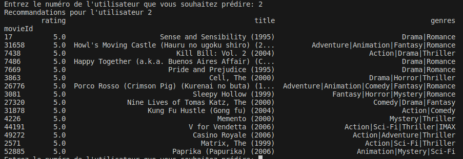

# collaborative-Filtering

Réalisation d'un système de recommandation basé sur les utilisateurs.

Utilisation de la mesure de similarité Pearson.

Le système retourne une liste de 10 films qu'il n'a pas regardé mais qu'on lui suggère de regarder. 

Pour lancé le programme , lancé la classe Recom_SA_vFINAL.py avec la commande suivant :
```bach
python Recom_SA_vFINAL.py
```

Voila un exemple comment ca marche :


